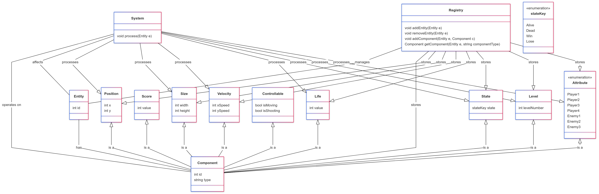
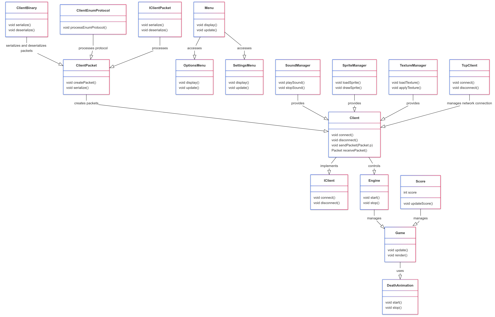
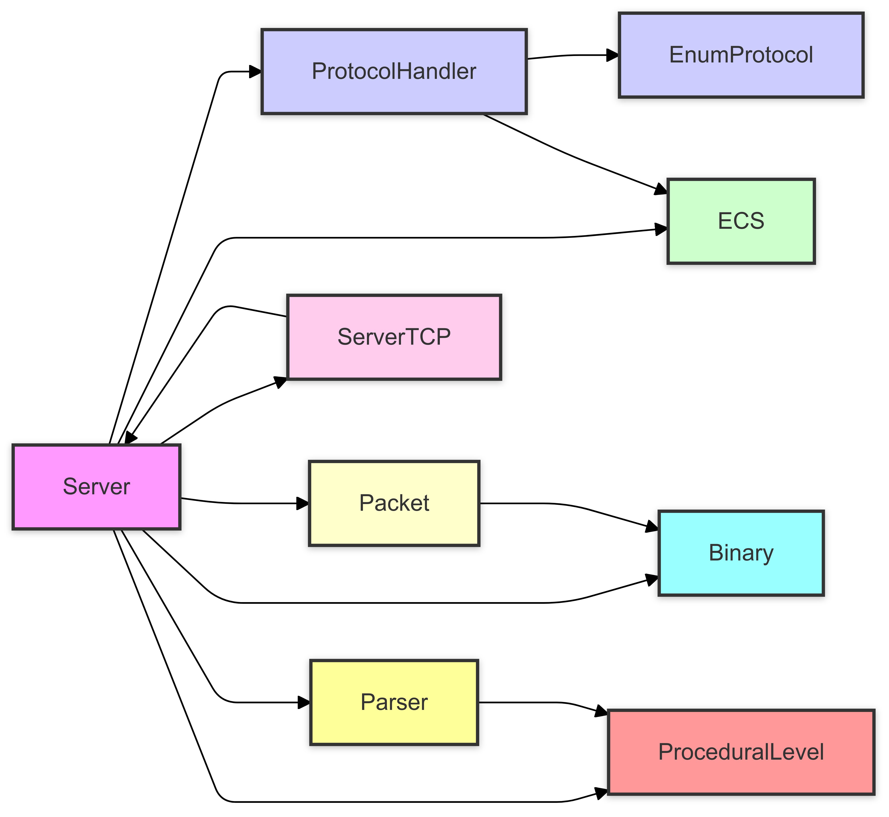

# Projet R-Type

Ce repo contient la structure d’un projet **R-Type** avec un **client**, **serveur**, et un **ECS** chacun dans son propre répertoire. Le projet utilise **CMake** pour gérer la configuration et la compilation. Le projet est compilable sur Linux et Windows.

# Compatibilité :

Linux & WINDOWS par Cmake

## Structure du projet

### ECS (Entity-Component-System)
L’architecture **ECS** est utilisée pour gérer les entités du jeu. Elle sépare les données (**composants**) de la logique (**systèmes**) afin de gérer efficacement les entités. Cette structure permet de garantir une grande flexibilité et une meilleure gestion des ressources pour un jeu de grande envergure.

### Serveur
Le serveur gère la communication réseau et la synchronisation de l’état du jeu. Il utilise plusieurs threads pour traiter les paquets entrants et sortants, garantissant ainsi un état de jeu cohérent entre les clients. Le serveur est développé pour fonctionner sur **TCP/UDP** et s’appuie sur **Asio** pour la gestion des sockets.

### Client
Le client est responsable de la communication avec le serveur, de l’envoi des actions des joueurs et du rendu de l’état du jeu reçu depuis le serveur. Il utilise une architecture **graphique** pour afficher l'état du jeu, gérer les inputs des joueurs et afficher les événements en temps réel.

## Instructions de compilation et d’exécution

### Étape 1 : Compiler le projet

Pour compiler le projet, exécutez simplement la commande suivante à la racine du dépôt :

```bash
make
```

### Étape 2 : Exécuter les programmes

Après la compilation, naviguez dans le répertoire `build`, puis dans les répertoires `client` et `server` pour exécuter les exécutables respectifs.

#### Démarrer le Serveur

```bash
cd build/server
./r_type_server
```

#### Démarrer le Client

```bash
cd build/client
./r_type_client
``` 

---

## Architecture de Communication

### Serveur
Le serveur fonctionne sur un **modèle multi-threads** pour traiter les requêtes des clients et gérer la logique de jeu. Il reçoit les paquets des clients, traite les actions (mouvement, tirs, état du jeu), et les renvoie aux joueurs connectés. 

- Le serveur gère les **lobbies** avec des commandes permettant de créer, rejoindre, quitter un lobby.
- Il utilise un **système ECS** pour traiter les entités du jeu en fonction de leur état (par exemple, le mouvement des joueurs, les collisions, la gestion des ennemis).

### Client
Le client gère l’interaction utilisateur et la communication avec le serveur via **UDP/TCP**. Chaque action (comme les déplacements, les tirs) est envoyée au serveur, et l’état du jeu est récupéré et affiché en temps réel. 

---

## Commandes disponibles pour l’interaction

### Commandes Serveur/Client

#### Liste des Lobbies
Le client peut demander la liste des lobbies disponibles via la commande `LIST_LOBBIES`.

#### Créer un Lobby
Un joueur peut créer un lobby en utilisant la commande `CREATE_LOBBY <lobbyId>`.

#### Rejoindre un Lobby
Un joueur peut rejoindre un lobby avec la commande `JOIN_LOBBY <lobbyId>`.

#### Quitter un Lobby
Un joueur peut quitter son lobby avec la commande `LEAVE_LOBBY`.

#### Envoyer un Message
Les joueurs peuvent envoyer des messages dans un chat de lobby via `SEND_MESSAGE <message>`.

#### Obtenir l’historique des messages
Les joueurs peuvent récupérer l’historique du chat avec `GET_CHAT_HISTORY`.

#### Récupérer les informations UDP
Les informations de connexion UDP pour rejoindre un lobby peuvent être récupérées via `GET_UDP_INFO <lobbyId>`.

---

## Diagrammes

### Diagrammes de l’Architecture

Les diagrammes suivants illustrent l'architecture de l'ECS, du Client et du Serveur pour mieux comprendre leur interaction. Vous pouvez consulter les diagrammes complets dans le dossier `docs` à la racine du projet.

- **ECS Architecture Diagram** :  
  
  
- **Client Architecture Diagram** :  
  
  
- **Server Architecture Diagram** :  
  


---

## Lien de la norme de commit

Le projet suit la norme de commit définie par **commitlint** avec la configuration **@commitlint/config-conventional**.

Vous pouvez consulter le lien pour plus de détails sur la norme de commit ici : [CommitLint Configuration](https://www.npmjs.com/package/@commitlint/config-conventional).

---

## Lien du coding style C++ 20 utilisé par cppcheck

Le style de codage C++20 utilisé par **cppcheck** pour l’analyse du code est disponible ici : [C++20 Coding Style](https://github.com/danmar/cppcheck/blob/main/man/manual.md).

---

## Contributeurs

Merci à tous les contributeurs qui ont participé à ce projet :

- **Mathis Champin**
- **Mathis Liberati**
- **Arthur Baudelot**
- **Pablo Peiro**
- **Alexandre Lorgeoux**
